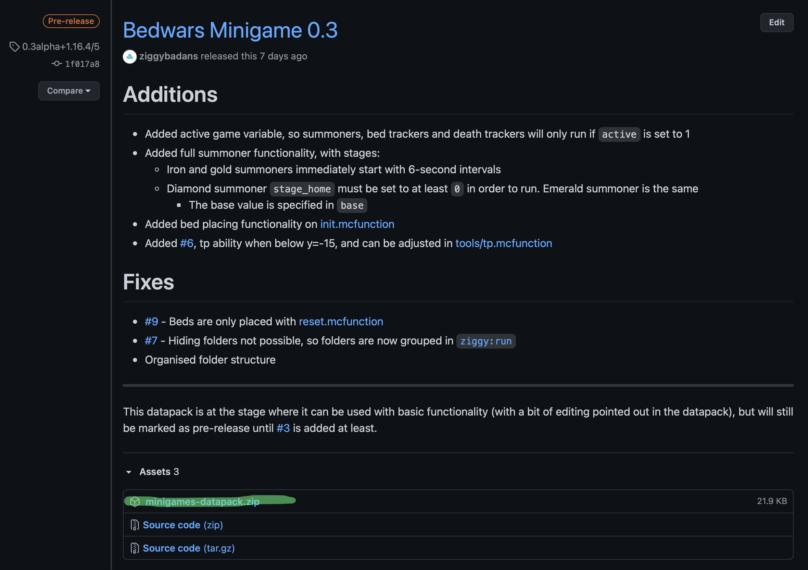

# Installation

## Downloading

Download the latest release from the [GitHub page](https://github.com/ziggybadans/minigames-datapack/releases).


Don't unzip this file! If it is unzipped automatically:

**Safari:** turn off _Open "safe" files after downloading_

Then redownload the file.


## Installation

Once the file is downloaded, follow these steps.

### 1. Finding the Minecraft Folder

#### Windows

On Windows, the default Minecraft folder is found by searching %APPDATA% in the search bar.

#### Mac

* Open Finder.
* Click Command+Shift+G
  * Paste `~/Library/Application Support/minecraft` and click Go.


If you have changed the Minecraft Directory through the launcher, then it will not be at these locations. Simply go to the folder you changed it to, then follow the steps below.


### 2. Adding the datapack

**On a new world:** On the world creation screen, and click on datapacks. Drag the ZIP file into the left menu, and then use the arrow to move the datapack to the right menu. Click done.  
**On an existing world:** Navigate to _.minecraft,_ then _saves._ Find the world you want, and then inside that navigate to _datapacks._ Put the ZIP file in here.  
**On a realm:** Create a backup of the world, and then download it. Follow the steps for an existing world. Once that is done, upload the world again.  
**On a dedicated server:** Find the world you want, then go to _datapacks_ and drop the ZIP file in there.

### 3. Reloading the world

After doing this, give yourself OP if you haven't already, then type `/reload`.


Do not type /reload on a **Spigot, Bukkit or any other server that uses plugins.** Using /reload can mess up the code and the sync of these plugins, and potentially corrupt your world.

To safely reload the world, stop the server and start it again \(`/restart`\).

_Fabric can safely use /reload, although if the FabricProxyLite mod is installed and you are using plugins, do not use /reload._

You can find out more about why you shouldn't use /reload on these servers [here.](https://madelinemiller.dev/blog/problem-with-reload/)


In some cases, the datapack may still be disabled. If this happens to you, type /datapack list. If it is disabled, it will show in red. Type /datapack enable minigames-datapack to fix this.

If the file name isn't listed, or you are having more issues:



